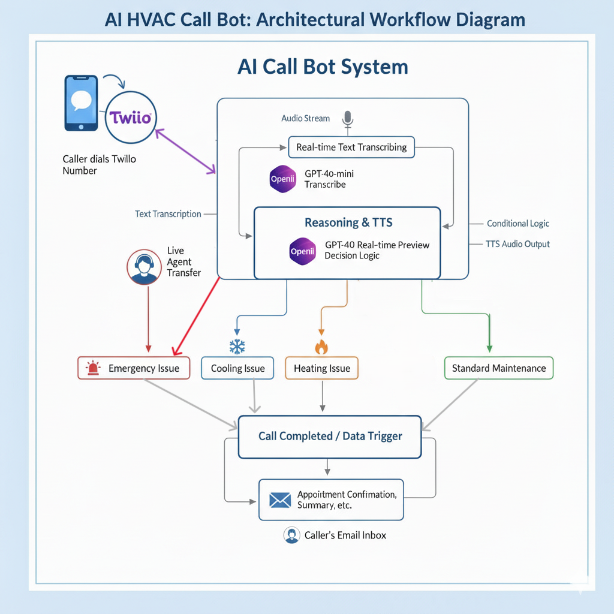

# 🤖 AI Call CoPilot

## AI Call CoPilot is a **voice-call assistant** that integrates **Twilio Voice**, **Flask**, **OpenAI** to handle and assist with **live phone conversations**.

## 🚀 Project Overview

The goal of this project is to build a **fully autonomous AI-powered communication system** capable of:

- Managing **incoming and outgoing calls** through Twilio Voice
- Transcribing calls in **instantly** using **OpenAI Realtime Transcription**
- Using **GPT reasoning** to generate intelligent and context-aware responses
- **Speaking directly to the caller** using **OpenAI Realtime Voice (built-in TTS)**
- Displaying all call activity, transcriptions, and AI responses on a **real-time agent dashboard**
- Generating **automated call summaries and quality reports** at the end of each call

Unlike traditional AI assist tools, the **AI Call CoPilot** operates **independently without agent intervention.**
The human agent **monitors the conversation** through the dashboard but does not interact with the caller.
All speech, trasncription, and dialog flow are handled inside a single **OpenAI Realtime model.**

This project showcases a **full-stack AI + Voice Engineering architecture**, combining:

- **Real-time AI inference (OpenAI Realtime model)**
- **Low-latency media streaming via WebSockets**
- **Twilio Voice orchestration**
- **Live analytics dashboard using Flask + SocketIO**

---

## 🧱 Architecture

**Data & Audio Flow:**



- All audio-in, transcription, reasoning, and audio-out are handled inside the OpenAI Realtime API.

---

**Tools & Components:**

- **Twilio Voice API** – Handles call routing and audio streaming
- **Flask Backend** – Hosts endpoints, TwiML responses, and dashboard updates
- **Stream Server (WebSocket)** – Processes audio, transcription, and AI logic
- **OpenAI Realtime API** - Handles transcription, reasoning, and voice output in a single model
- **Frontend (HTML, CSS, JS)** – Displays real-time updates, AI replies, and agent actions

---

## ⚙️ Technology Stack

| Layer         | Tools / Libraries                          |
| ------------- | ------------------------------------------ |
| **Backend**   | Python (Flask,Flask-SocketIO)              |
| **Streaming** | WebSockets, Twilio Media Streams           |
| **AI Models** | OpenAI Realtime                            |
| **Frontend**  | HTML, CSS, JavaScript                      |
| **Optional**  | Node.js for managing frontend dependencies |

---

## 📂 Repository Structure

```
AI_Call_CoPilot/
│
├── app.py # Flask backend (routes & dashboard updates)
├── stream_server.py # Handles Twilio media stream & AI logic
│
├── templates/ # HTML templates
│ └── dashboard.html # Agent dashboard UI
│
├── static/ # Frontend assets
│ ├── css/ # Stylesheets
│ ├── js/ # Dashboard scripts
│ └── tts/
│
├── logs/ # Optional logs directory
├── requirements.txt # Python dependencies
├── package.json # Node dependencies (optional)
├── README.md # Documentation
└── .env # Environment variables (excluded from Git)
```

---

## ⚙️ Setup & Installation

### 1️⃣ Clone the Repository

```bash
git clone reponame
cd AI_Call_CoPilot
```

### 2️⃣ Create a Virtual Environment

```bash
python -m venv venv
venv\Scripts\activate    #(Mac or Linux : source venv/bin/activate)
pip install -r requirements.txt
npm install(optional)
```

### 3️⃣ Configure Environment Variables

Add your credentials in `.env` or environment variables:

```bash
OPENAI_API_KEY=your_openai_api_key
DEEPGRAM_API_KEY=your_deepgram_api_key
TWILIO_ACCOUNT_SID=your_twilio_sid
TWILIO_AUTH_TOKEN=your_twilio_auth_token
TWIML_APP_SID=your_twiml_app_sid
TWILIO_NUMBER=your_twilio_phone_number
STREAM_PORT=8000
FLASK_SOCKET_URL=http://127.0.0.1:5000/update
PUBLIC_BASE_URL=https://your-public-url
```

### 4️⃣ Run Application

```bash
# Terminal 1 - Start Flask backend
python app.py

# Terminal 2 - Start WebSocket stream server
python stream_server.py

```

If Twilio needs to access your local app, expose it using Ngrok, Cloudflared, or LocalTunnel, and update the PUBLIC_BASE_URL in .env.

---

## 🧩 Typical call flow

- **Caller dials** the Twilio number.
- Twilio triggers a **Flask TwiML endpoint** that establishes the WebSocket connection.
- The **WebSocket Stream Server** receives live audio data from the caller.
- The audio is streamed directly to the **OpenAI Realtime API.**
- **GPT reasoning** generates a real-time AI reply based on conversation context.
- The model performs transcription, reasoning, and voice generation in one pipeline.
- The Realtime API streams back synthesized speech instantly to Twilio.
- Meanwhile, the dashboard **displays** the full transcription, responses, and AI call analysis in real time.

---

## 🧾 Additional Notes

- node_modules and venv are intentionally excluded from the repository.
- All keys and credentials are stored securely in .env.
- Update FLASK_SOCKET_URL in .env if the dashboard or Socket.IO endpoint changes.
